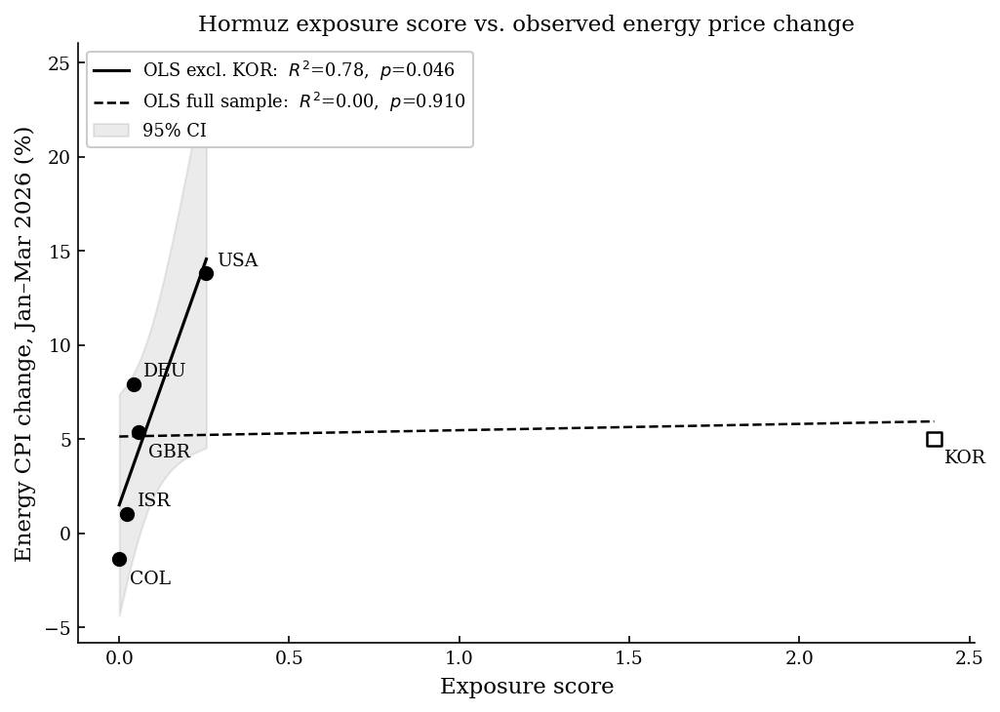

# Can Oil Trade Networks Predict Energy Price Shocks? A Hormuz Closure Case Study

---

## Motivation

I was interested in applying network theory to a macroeconomic problem. When war broke out between Iran and the U.S./Israel on February 28, 2026 and the Strait of Hormuz was effectively closed to shipping, it presented a natural experiment. The Strait carries roughly 20% of global oil supply, and I wanted to see whether modeling international oil trade as a graph could predict which countries would be most impacted, and whether that prediction held up against real energy price data.

---

## Methodology

### Data

Trade flows are sourced from the BACI HS22 2024 dataset (CEPII), which records bilateral trade volumes between all country pairs. We filter to crude oil (HS 2709), refined petroleum (HS 2710), and petroleum gases (HS 2711), yielding roughly 9,700 directed trade relationships. Validation data comes from the OECD Energy CPI series (CP045_0722), measuring the percentage change in energy prices from January to March 2026.

### Graph Construction

Global oil trade is represented as a weighted directed graph. Each node is a country and each directed edge is a trade flow, weighted by annual volume in thousand tonnes. Two special nodes are added.

**WORLD_SUPPLY** is a dummy source node connected to every exporting country, representing the global oil market as a single starting point for flow calculations.

**HORMUZ** is a transit node representing the Strait as a physical chokepoint. The eight Gulf exporters (Saudi Arabia, Iraq, Iran, UAE, Kuwait, Qatar, Bahrain, and Oman) route their flows through this node rather than connecting directly to importers. A flow from Saudi Arabia to Japan, for example, becomes two edges: SAU to HORMUZ and HORMUZ to JPN. Where known pipeline bypasses exist (Saudi Arabia's East-West pipeline, the UAE's Habshan-Fujairah pipeline), the bypass fraction travels on a direct edge and only the remainder routes through HORMUZ. Bypass capacity fractions are sourced from the U.S. EIA World Oil Transit Chokepoints report.

### Simulating the Closure

The closure is modeled by deleting the HORMUZ node and all its edges. Any flow routed through it is immediately severed while pipeline bypass flows remain intact.

### Exposure Score

Two quantities are computed per importing country.

**Volume loss** uses max flow to find the maximum oil volume reachable from WORLD_SUPPLY to the importer, before and after closure. Max flow is appropriate here because it accounts for the full capacity structure of the network, not just direct Gulf imports. The drop gives volume loss:

$$\text{volume\_loss} = \frac{\text{flow\_before} - \text{flow\_after}}{\text{flow\_before}}$$

**Rerouting cost** assigns each edge a cost of $1 / (\text{capacity} + 1)$, so established high-volume routes are cheap and obscure routes are expensive. Dijkstra's shortest path is run from each importer's top three suppliers before and after closure. The rerouting cost is the percentage increase in average path cost. If a supplier becomes completely unreachable after closure, a cap of 500% is applied.

The combined exposure score is:

$$\text{exposure} = \text{volume\_loss} \times (1 + \text{rerouting\_cost})$$

Rerouting cost acts as a multiplier. A country that loses 50% of supply with no alternatives scores higher than one that loses 50% but can substitute from other suppliers.

---

## Results

### Exposure Rankings

The ten most exposed countries under a Hormuz closure scenario are:

| Rank | Country | Exposure Score |
|------|---------|---------------|
| 1 | Madagascar | 5.64 |
| 2 | Pakistan | 5.04 |
| 3 | Thailand | 4.65 |
| 4 | Uganda | 4.48 |
| 5 | Maldives | 4.41 |
| 6 | Kenya | 3.64 |
| 7 | Seychelles | 3.52 |
| 8 | Zambia | 3.25 |
| 9 | Japan | 2.67 |
| 10 | Malawi | 2.65 |

Countries with high Gulf import dependency and no alternative supply routes rank highest. Japan and South Korea rank highly due to their heavy reliance on Gulf crude. The United States, Brazil, and most of Western Europe rank near the bottom, as they source primarily from Atlantic basin suppliers.

### Validation

Exposure scores are merged with OECD energy CPI changes (January to March 2026) and OLS regression is used to test whether predicted exposure tracks observed price changes.

| Sample | n | R² | p-value |
|--------|---|----|---------|
| Full sample | 6 | 0.004 | 0.910 |
| Without South Korea | 5 | 0.782 | 0.046 |

Inspecting the scatter plot, South Korea appeared to be an outlier: it has the highest exposure score (2.40) among the validation countries but a price increase of only 5.0%, comparable to the UK (5.4%) and lower than Germany (7.9%), both of which have near-zero exposure scores. Removing Korea yields a statistically significant result (p = 0.046, R² = 0.78), with the remaining countries ranking in nearly the correct order by price impact. Korea's muted response likely reflects its large strategic petroleum reserve and long-term supply contracts, which buffer short-term market shocks.

The hypothesis is partially supported. The full sample result is not significant, but once Korea is excluded the model predicts observed price changes with statistical significance, suggesting the graph-based exposure score does capture real economic impact when country-specific factors are accounted for.

### Regression Plot

---

## Limitations

**Sample size.** The OECD energy CPI series was only available for 6 countries for the January to March 2026 period at time of writing, due to publication lag. High-exposure countries such as Japan, Thailand, and Pakistan, which would be the most informative validation points, did not yet have data.

---

## Data Sources

- CEPII BACI HS22 V202601 (2024 trade flows): www.cepii.fr/CEPII/en/bdd_modele/bdd_modele_item.asp?id=37
- OECD.Stat, Consumer Prices series CP045_0722 (energy CPI): stats.oecd.org
- U.S. EIA, World Oil Transit Chokepoints (pipeline bypass estimates): eia.gov/international/analysis/special-topics/World_Oil_Transit_Chokepoints
